<p align="center">
  
</p>

<p align="center">
  <strong>AI-assisted lesson planning for Ghanaian schools.</strong>
</p>

<p align="center">
  <a href="https://schemeknit-frontend.onrender.com">Live Preview</a> &middot;
  <a href="https://github.com/Delkay-byte/SchemeKnit">GitHub</a> &middot;
  <a href="https://schemeknit-frontend.onrender.com/contact/">Contact</a>
</p>

---

## What is SchemeKnit?

SchemeKnit helps teachers turn a **scheme of work** into structured, curriculum-aligned **lesson plans**. It is built for Ghanaian schools — KG, Primary, JHS, and SHS — and follows the GES lesson plan format.

A teacher uploads a scheme document. SchemeKnit extracts the curriculum content, validates the indicators, and generates individual lesson plans that can be edited and exported as DOCX, PDF, XLSX, or ZIP.

## Why SchemeKnit?

Writing lesson plans from a scheme of work is time-consuming and repetitive. SchemeKnit automates the transformation while keeping the teacher in control:

- **Upload once, generate many** — a single scheme document produces a full term of lesson plans
- **Curriculum alignment** — indicators are validated against the GES framework before generation
- **Editable output** — every generated lesson can be refined by the teacher
- **Multiple exports** — DOCX for editing, PDF for printing, XLSX for registers, ZIP for batch download
- **Works offline** — the desktop application runs without internet

## How it works

```
Upload  →  Detect  →  Confirm  →  Review  →  Allocate  →  Generate  →  Edit  →  Export
scheme      subjects    subject      curriculum  indicators  lesson        refine   DOCX / PDF /
of work     in one      section      content     to teaching plans         lessons  XLSX / ZIP
            document                 extract     periods
```

1. **Upload** a scheme of work (DOCX or PDF)
2. **Detect** — if one document contains several subjects for the same level, confirm which subject section to use
3. **Review** the extracted strands, sub-strands, content standards, and indicators
4. **Validate** — SchemeKnit flags missing or duplicate indicators
5. **Allocate** indicators to teaching periods within the school calendar
6. **Generate** lesson plans for each teaching period
7. **Edit** any generated lesson to match your teaching style
8. **Export** as DOCX, PDF, XLSX, or download everything as a ZIP

## Core teaching model

SchemeKnit enforces a single core rule:

> **ONE INDICATOR → ONE TEACHING PERIOD → ONE LESSON PLAN**

A *week* in the scheme represents curriculum scope — the content to be covered. Within that week, each indicator maps to one teaching period and produces one lesson plan. If a week has three indicators, SchemeKnit generates three separate lesson plans.

This ensures every indicator receives dedicated teaching time and no lesson plan tries to cover multiple unrelated objectives.

When a curriculum week contains more indicators than the teacher has teaching periods, the remaining indicators **carry forward** to the following teaching week. Every lesson keeps both its original curriculum week and the actual teaching week it is taught in, and nothing is dropped, duplicated, or merged.

## Key features

- **Scheme parsing** — extracts curriculum structure from DOCX/PDF scheme documents
- **Curriculum validation** — detects missing, duplicate, and unallocated indicators
- **Allocation engine** — maps indicators to teaching periods with conflict detection
- **Lesson generation** — produces complete lesson plans with objectives, activities, assessment, and conclusion
- **AI enrichment** — optional AI-assisted content generation (via OpenCode Zen free models)
- **Approved GES templates** — built-in lesson plan templates matching the official Ghana Education Service format
- **Multi-format export** — DOCX, PDF, XLSX, and ZIP batch download
- **Concurrent PDF generation** — multiple teachers can export PDFs simultaneously
- **Desktop offline mode** — full functionality without internet on Windows

## Designed for Ghanaian schools

SchemeKnit is built specifically for the Ghana education system:

- **GES lesson plan format** — templates follow the official structure for KG, Primary, JHS, and SHS
- **Ghana curriculum framework** — strands, sub-strands, content standards, and indicators match the national curriculum
- **Public holidays** — Ghana public holidays are pre-loaded for calendar planning
- **School licensing** — activation-code-based licensing for school deployments
- **Teacher management** — school admins can create and manage teacher accounts

SchemeKnit is an independent product and is not endorsed by or affiliated with the Ghana Education Service or the Government of Ghana.

## User roles

| Role | Available on | Description |
|------|-------------|-------------|
| **Platform Admin** | Web only | Manages schools, licenses, activation codes, product plans, and platform settings |
| **School Admin** | Web + Desktop | Manages teachers within their school, uploads schemes, generates lessons for the school |
| **Teacher** | Web + Desktop | Uploads schemes, generates and edits personal lesson plans |
| **Individual Teacher** | Web only | Standalone teacher without a school affiliation |

## Exports

| Format | Use case |
|--------|----------|
| **DOCX** | Editable lesson plans — open in Microsoft Word or Google Docs |
| **PDF** | Print-ready lesson plans — desktop uses bundled LibreOffice, web uses pymupdf |
| **XLSX** | Lesson register / tracking spreadsheet |
| **ZIP** | Batch download of all exports for a generation job |

Desktop PDF export works **offline** through a bundled LibreOffice runtime.

## Product preview

<p align="center">
  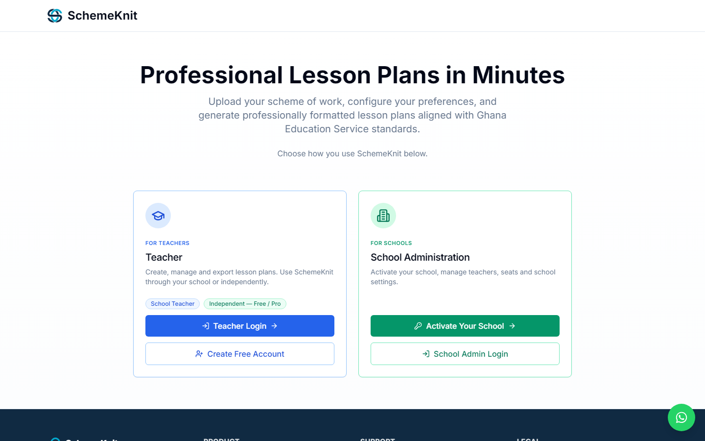
</p>

### Teacher login

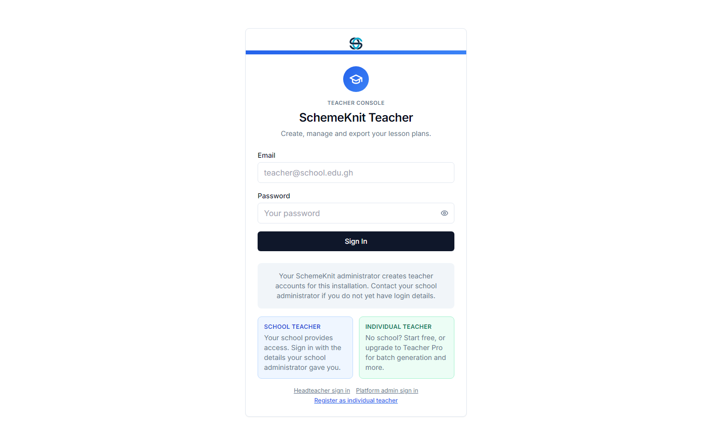

### Upload a scheme of work

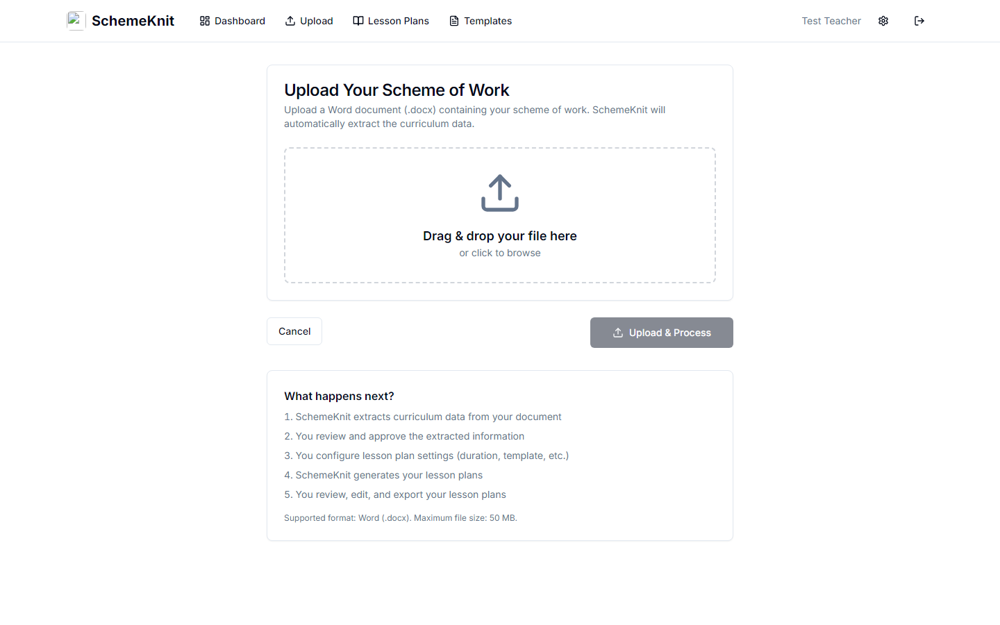

### Configure and generate lesson plans

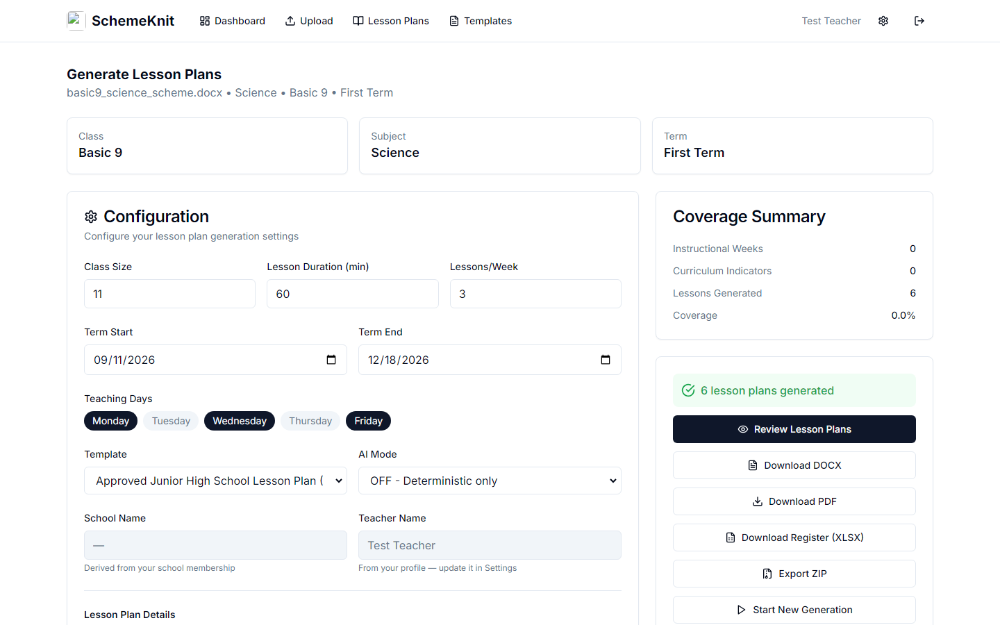

### Edit generated lesson plans

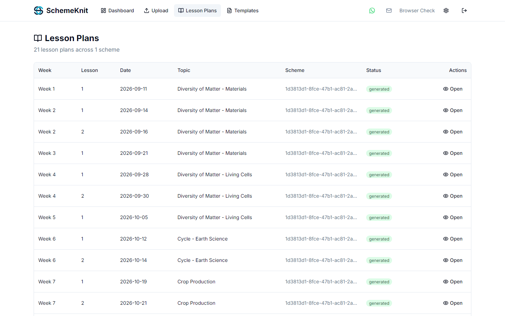

### Export as DOCX, PDF, XLSX, or ZIP

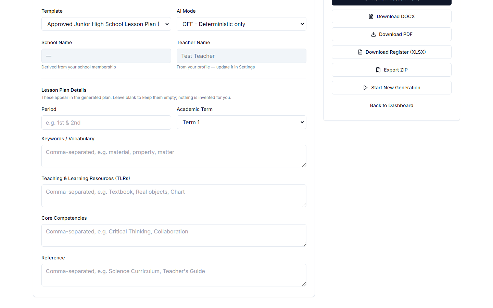

### Teacher dashboard

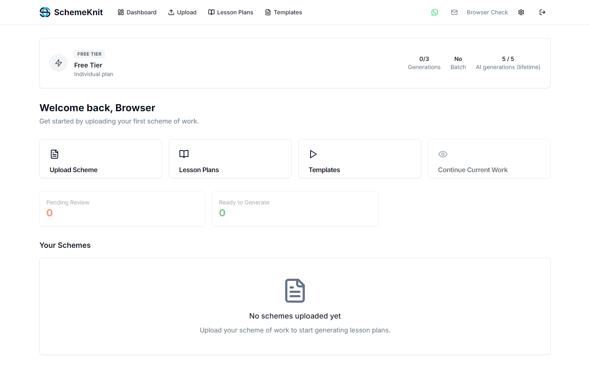

### School Admin / Headteacher dashboard

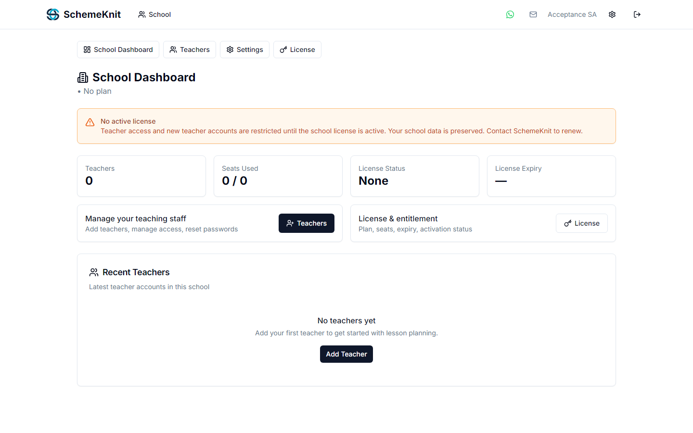

### Platform Admin console (direct route only)

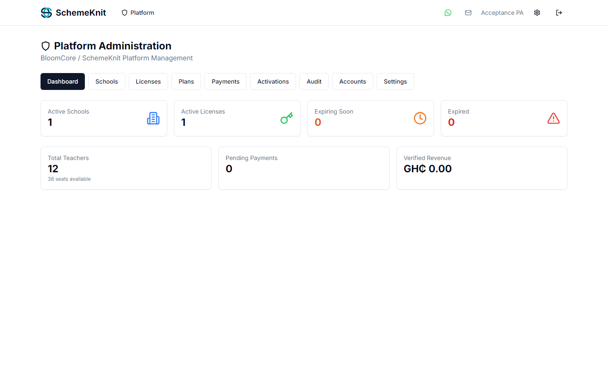

### Multi-subject document detection

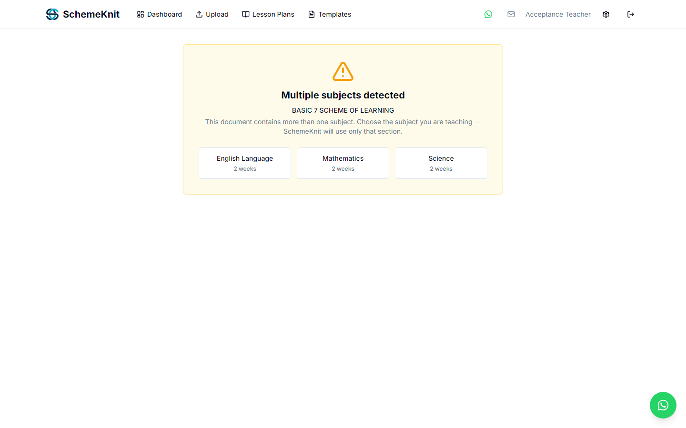

### Subject-specific review after confirmation

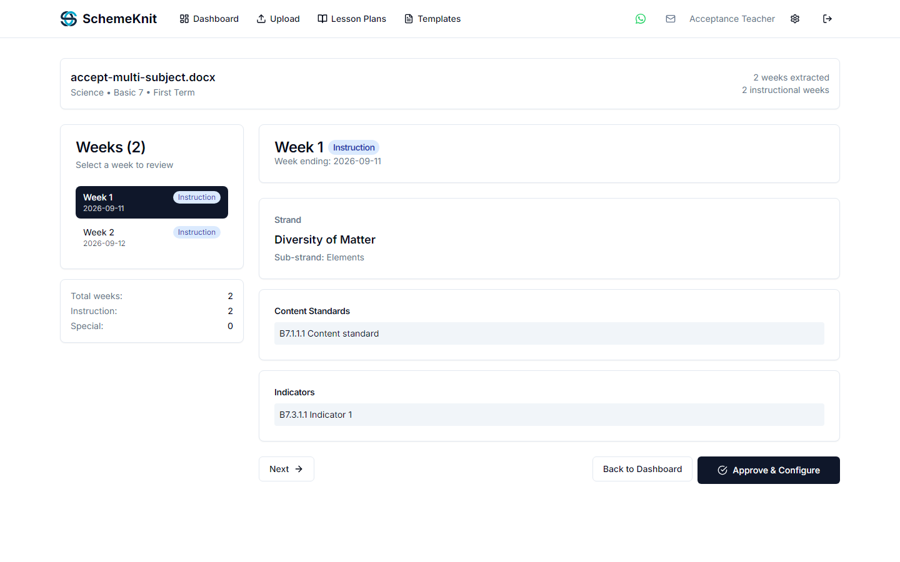

## Project structure

```
SchemeKnit/
├── backend/          FastAPI backend (Python)
│   ├── src/          Application code, routers, engines, models
│   ├── tests/        Backend test suite
│   └── migrations/   Database migration scripts
├── frontend/         Next.js frontend (TypeScript)
│   ├── src/          Pages, components, lib
│   └── public/       Static assets, icons, PWA manifest
├── desktop/          Electron desktop application (Windows)
│   ├── main.js       Electron main process
│   └── backend.spec  PyInstaller build specification
├── docs/             Documentation and acceptance reports
└── assets/           Brand assets (SVG, ICO, color tokens)
```

## Web architecture

```
Browser  →  Next.js Frontend  →  FastAPI Backend  →  PostgreSQL (Neon)
                                        ↓
                               Cloudflare R2 (file storage)
                               Resend (transactional email)
                               OpenCode Zen (AI enrichment)
```

- **Frontend**: Next.js 14, React 18, Tailwind CSS, Radix UI
- **Backend**: FastAPI 0.141, SQLAlchemy 2.0, Python 3.11
- **Database**: PostgreSQL (Neon serverless)
- **Storage**: Cloudflare R2 (S3-compatible)
- **Email**: Resend
- **AI**: OpenCode Zen — free models (Nemotron 3 Ultra Free, MiMo V2.5 Free)

## Desktop application

The desktop version is a **local-first, offline-capable** Windows application:

- **Backend**: Same FastAPI codebase, packaged as a standalone executable via PyInstaller
- **Database**: SQLite (local file, no server required)
- **Storage**: Local filesystem
- **PDF export**: Bundled LibreOffice runtime (works offline)
- **Installer**: Self-contained Windows installer (~500 MB)
- **No internet required** — all processing happens on the user's machine

The desktop and web versions share the same backend code but operate independently. Desktop data never leaves the user's computer.

## Local development

### Backend

```bash
cd backend
python -m venv venv
source venv/bin/activate  # Windows: venv\Scripts\activate
pip install -r requirements.txt
cp .env.example .env     # Set DEBUG=true for local dev
python -m uvicorn src.main:app --reload --host 127.0.0.1 --port 8000
```

### Frontend

```bash
cd frontend
npm install
npm run dev              # Opens at http://localhost:3000
```

### Desktop

```bash
cd desktop
npm install
python package_backend.py   # Package backend for PyInstaller
build.bat                   # Build installer (requires NSIS + PyInstaller)
```

## Environment configuration

See [`backend/.env.example`](backend/.env.example) for the full list of environment variables. No real secrets, tokens, or credentials are committed to this repository.

| Variable | Purpose | Required |
|----------|---------|----------|
| `DATABASE_URL` | PostgreSQL connection string | Production |
| `SECRET_KEY` | Session signing secret | Production |
| `JWT_SECRET_KEY` | JWT signing secret | Production |
| `STORAGE_BACKEND` | `local` or `s3` | Production |
| `S3_ENDPOINT` | R2/S3 endpoint URL | When `STORAGE_BACKEND=s3` |
| `S3_BUCKET` | Object storage bucket | When `STORAGE_BACKEND=s3` |
| `RESEND_API_KEY` | Resend email API key | Production |
| `AI_MODE` | `OFF`, `opencode-zen`, `ollama`, etc. | Optional |
| `PLATFORM_ADMIN_BOOTSTRAP_SECRET` | One-time bootstrap secret | First deploy |
| `PREVIEW_MODE` | Allow test email sender | Preview builds |

## Status

| Component | Status |
|-----------|--------|
| Web preview | Available at [schemeknit-frontend.onrender.com](https://schemeknit-frontend.onrender.com) |
| Desktop 1.0.5 | Windows installer available (see [Desktop Release Notes](docs/DESKTOP-1.0.5-RELEASE.md)) |
| Backend tests | 834 passed, 7 skipped, 0 failed |
| Production deployment | Not yet finalized — preview environment only |

## Security and privacy

- Secrets and local databases are excluded from Git through `.gitignore`
- API keys and database credentials are stored in environment variables, never in source code
- Desktop data stays on the local machine — no telemetry, no cloud sync
- Authentication uses JWT tokens with bcrypt password hashing
- Rate limiting is applied to authentication endpoints

If you discover a security vulnerability, please email [security@schemeknit.com](mailto:security@schemeknit.com).

## Contact

SchemeKnit is a product of **BloomCore Technologies**.

- **Email**: [bloomcoretechnologies@gmail.com](mailto:bloomcoretechnologies@gmail.com)
- **WhatsApp**: [+233 24 006 4668](https://wa.me/233240064668) (local: 0240064668)
- **Billing**: [billing@schemeknit.com](mailto:billing@schemeknit.com)
- **Security vulnerabilities**: [security@schemeknit.com](mailto:security@schemeknit.com)

## Copyright

&copy; 2026 SchemeKnit. All rights reserved.

This is proprietary software. The source code is available for inspection but is not open source. No open-source license is granted.
